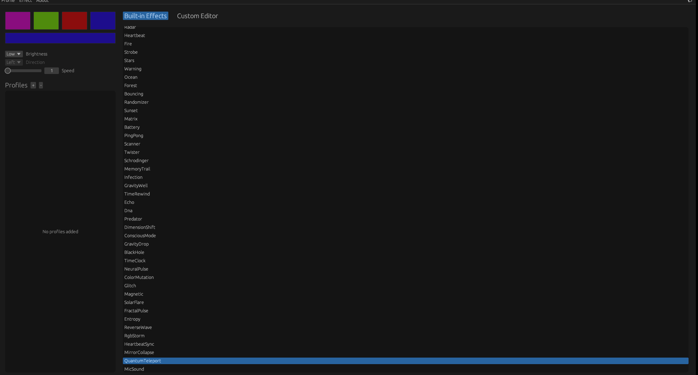

---

## 🔄 Original vs Enhanced Version

This section highlights the **technical and visual transformation** from the original project to this upgraded version.

---

### 📂 Architecture Evolution

| Component        | Original         | Enhanced Version                                       |
| ---------------- | ---------------- | ------------------------------------------------------ |
| GUI Layout       | Simple linear UI | **Advanced split-screen layout**                       |
| Effect Editor    | ❌ Not available  | ✅ **Visual sequence builder**                          |
| Manager Loop     | Basic loop       | **Safe threaded engine with exit protection**          |
| Effects Registry | Limited set      | **70+ advanced effects**                               |
| Effects Library  | Basic animations | **Massive library (Black Hole, Neural, Glitch, etc.)** |

---

### 🎨 User Interface

* **Original**

  * Single vertical layout
  * Technical and less intuitive

* **Enhanced Version**

  * ⚡ Professional **side-by-side workspace**
  * 📌 Fixed 300px panel for stability
  * 🎯 Designed for both beginners and advanced users

---

### ⚡ Animation Engine

* **Original**

  * Only forward looping

* **Enhanced Version**

  * 🔁 Ping-Pong (Back & Forth)
  * 🎲 Random playback
  * 🎨 Dynamic sequence traversal

---

### 🛡️ Stability & Performance

* **Original**

  * Could freeze or crash during exit

* **Enhanced Version**

  * ⚙️ **Granular Sleep system (10ms checks)**
  * 🚀 Smooth shutdown handling
  * 🔒 Improved long-run stability

---

### 🧙 Smart Presets

* **Original**

  * Manual effect creation

* **Enhanced Version**

  * One-click presets:

    * 🌊 Wave
    * 🌈 Rainbow
    * 🚨 Police

---

### 🧠 Effects Library Expansion

* Expanded to **70+ high-end effects**, including:

  * Black Hole
  * Quantum Teleport
  * Neural Pulse
  * Glitch Engine
  * Matrix Flow

Each effect is tuned specifically for **Legion keyboard hardware**.

---

### 🏷️ Branding & Credits

* **Original**

  * Single author credit
  * Donation links present

* **Enhanced Version**

  * 🤝 Credits both:

    * 4JX (Original Author)
    * ABHI-devhome (Enhancements)
  * ❌ Donation links removed
  * 🎯 Cleaner, professional presentation

---

## 🧩 Summary

This project is not just an update — it is a **full system evolution**:

> From a basic RGB controller
> → To a customizable, algorithm-driven lighting engine

---

## 🎥 Preview

### NeuralRGB

